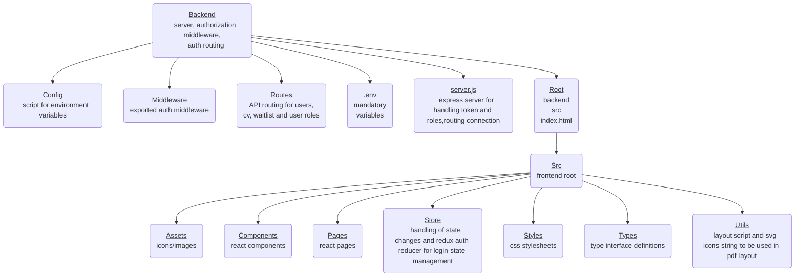

# Project: CV-Portal.io

## Table of Contents
1. [Introduction](#introduction)
2. [Dependencies](#dependencies)
3. [Project Structure](#project-structure)
4. [Setup and Installation](#setup-and-installation)
5. [Configuration](#configuration)
6. [Running The Application](#running-the-application)
7. [Relevant Features and Functionality](#features-and-functionality)
8. [Reference Material](#reference-material)

---

## Introduction

#### CV-Portal.io is an application built in React & TypeScript. It allows users to create, edit, and preview their CVs directly in the browser, while persisting login sessions and user roles (admin/user) with JWT-based authentication.

---

## Dependencies

**Frontend**:  
- `React` (18.3.1)  
- `react-router-dom` (7.0.2)
- `@reduxjs/toolkit` (2.4.0)
- `Typescript` (5.6.2)  
- `react-icons`  (5.4.0)
- `jsPDF` (2.5.2)  
- `@types/react /react-dom`  (18.3.12 / 18.3.1)

**Backend**:  
- `express` (4.21.2)  
- `bcryptjs` (2.4.3) 
- `jsonwebtoken` (9.0.2)  
- `cookie-parser` (1.4.7)  
- `cors` (2.8.5) 
- `dotenv` (16.4.7)  

**Other**:  
- `axios` (1.7.9)   
- `concurrently` (9.1.0)   
- `@testing-library/jest-dom` (6.6.3) 
- `@testing-library/react` (16.1.0) 

---

## Project Structure

--- 

## Setup and installation

1. Clone the repository: `git clone https://github.com/oddzor/Exam-Javascript-Frameworks.git`
2. Navigate to the project directory: `cd [your-project-directory]`
3. Install dependencies: `npm install`
4. <em>**[Set up environment variables](#configuration) in a `.env` file.**</em>

--- 

## Configuration
  
> [!CAUTION]  
> Failing to create an .env-file in the **<u>ROOT OF THE BACKEND FOLDER</u>** and using these keys will cause app to not work as intended.

> [!IMPORTANT]  
> **If encountering issues with server connection, install plugins to allow CORS**
  

- **ENDPOINT_URL**: ``https://crudcrud.com/api/<your-unique-endpoint>``
- **BACKEND**: ``http://localhost:<your-selected-port>``.
- **ADMIN_USERNAME**: ``<your-preferred-admin-username>``
- **ADMIN_PASSWORD**: ``<your-preferred-admin-password>``
- **JWT_SECRET**: ``<your-secret-code>`` (random 8-bit hex code used)
- **PORT**: ``<your-selected-port>``.

---

## Running the application.

To run the app, use `npm run dev` as this is defined in the concurrently config to run both ends of the application simultaneously (if that doesnt work, do it the old way and run them separately).

---

## Relevant features and fucntionality.

## **Backend**

#### <u>Server</u>

Handles HTTP requests via Express, sets up CORS, JSON parsing, cookie parsing, and attaches defined routes. It listens on a specified port, connecting both ends together.

#### <u>Middleware</u>

Checks role flag in the payload and authentication status. Uses a valid JWT as a access controller to certain endpoints.

#### <u>Routes</u>

Defines the HTTP endpoints. Each route file is set up to ensure specific data operations such as creating, reading, updating, and deleting are handled correctly. 
Middleware is used to ensure users can only access their intended endpoints.

---

## **Frontend**

### React Components

#### <u>CvForm</u>

A form component allowing users to create or update their CV. It collects and stores local states for data, and upon request posts the data to the backend for persistent storage.

#### <u>CvPreview</u>

Renders a preview of the generated CV in an embedded iframe. After the CV data is provided, this component renders the CV for the user to review before exporting or finalizing.

#### <u>WaitList</u>

Shows user registration requests for admins. It allows searching, approving (pseudo-registering), and rejecting entries, triggering specific CRUD operations for these actions. If the user is "approved" the data is removed from the waitlist endpoint and posted to the users endpoint.

#### <u>UserList</u>

Allows admin to see all users, with options to edit(user), delete(user), or view their CVs (and edit once routed to CvPage). It fetches user data from the backend and handles CRUD-operations according to routes.

### Pages

#### <u>LoginPage</u>

Login form that sends credentials to the backend, and on success, manages state providing a role, depending on what type of user logged in.

#### <u>AdminPage</u>

Admin dashboard that provides management of user accounts, requested registrations or the option to create users without request. Implements middleware to ensure protected endpoints are not breached by users.

#### <u>CvPage</u>

CV creation tool, allows the user to create a CV (if none are created), or lists your CVs and allows you to edit, delete or preview the existing CVs. 

---

## **React/Jest Testing**

#### <u>CV Test</u>

Runs mock requests to API endpoints to ensure that the request is accepted provided the payload contains the correct data.

#### <u>Endpoint Test</u>

Sends a GET and PUT request to mock endpoints to ensure that routing functionins properly.

#### <u>Middleware Test</u>

Decodes JWT to check for ``role : admin``, which will be used in authentication and restriction of API endpoints among other things.

---

## Reference Material

**References**

- [Redux-Toolkit Store Configuration](https://redux-toolkit.js.org/api/configureStore)
- [Auth Handling With Redux Toolkit](https://blog.logrocket.com/handling-user-authentication-redux-toolkit/)
- [React-Router-DOM Documentation](https://reactrouter.com/start/framework/routing)
- [jsPDF Documentation](https://artskydj.github.io/jsPDF/docs/jsPDF.html)
- [React + Typescript Cheatsheet](https://react-typescript-cheatsheet.netlify.app/docs/basic/setup)
- [expressJS Documentation](https://expressjs.com/en/guide/routing.html)
- [JWT Handbook](https://assets.ctfassets.net/2ntc334xpx65/o5J4X472PQUI4ai6cAcqg/3b04b28c3148a640d6eb2713d2cd9877/jwt-handbook-v0_14_2.pdf)
- [brcrypt NPM Documentation](https://www.npmjs.com/package/bcryptjs?activeTab=readme)
- [Kebab Case Naming Convention](https://www.tuple.nl/knowledge-base/kebab-case)
- [React Testing Library Documentation](https://testing-library.com/docs/react-testing-library/intro)
- [Testing React Apps](https://jestjs.io/docs/tutorial-react)
- [Configuring Jest With Typescript](https://jestjs.io/docs/configuration)

**Previous projects**
- [Exam WEBTEK 2024](https://github.com/oddzor/Eksamen-Webteknologi)
- [Mandatory Assignment REACT 2024](https://github.com/oddzor/Arbeidskrav-2---Javascript-Rammeverk)
- [Mandatory Assigment WEBTEK 2024](https://github.com/oddzor/https---github.com-oddzor-AK1---Webteknologi.git)

